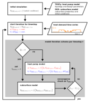

# Coupled simulation of a DUBHE with a heat pump

This repository holds the data, python scripts for modeling and notebooks for
data preparation and evaluation of the results for the paper
"Thermal performance response and heat load redistribution mechanism of a deep
U-type borehole heat exchanger in heating systems" submitted to Applied Energy.

For the paper open source software for thermodynamic plant modeling
((Thermal Engineering Systems in Python)[https://tespy.readthedocs.io]) and for
thermo-hydro-mechanical-chemical modeling of the subsurface
((OpenGeoSystems)[https://www.opengeosys.org/]) have been coupled.

## Installation and usage

After downloading install the requirements within a fresh virtual environment:

```sh
python -m pip install -r requirements.txt
```

## Coupling Scheme

The two simulators have been coupled according to the figure below. The heat
demand time series controls the operation of the heat pump. Based on the heat
demand, the heat demand temperature level as well as the BHE flow rate and
outflow temperature the heat pump model calculates the BHE re-injection
temperature. Next, the DUBHE simulation is started to update the BHE outflow
temperature. Once convergence on the BHE outflow temperature has been reached,
the iteration process is started for the next time step in the heat demand time
series.


*Coupling scheme for OGS and TESPy*

## License

Copyright (c) 2024 Francesco Witte, Chaofan Chen

Permission is hereby granted, free of charge, to any person obtaining a copy of
this software and associated documentation files (the "Software"), to deal in
the Software without restriction, including without limitation the rights to
use, copy, modify, merge, publish, distribute, sublicense, and/or sell copies of
the Software, and to permit persons to whom the Software is furnished to do so,
subject to the following conditions:

The above copyright notice and this permission notice shall be included in all
copies or substantial portions of the Software.

THE SOFTWARE IS PROVIDED "AS IS", WITHOUT WARRANTY OF ANY KIND, EXPRESS OR
IMPLIED, INCLUDING BUT NOT LIMITED TO THE WARRANTIES OF MERCHANTABILITY, FITNESS
FOR A PARTICULAR PURPOSE AND NONINFRINGEMENT. IN NO EVENT SHALL THE AUTHORS OR
COPYRIGHT HOLDERS BE LIABLE FOR ANY CLAIM, DAMAGES OR OTHER LIABILITY, WHETHER
IN AN ACTION OF CONTRACT, TORT OR OTHERWISE, ARISING FROM, OUT OF OR IN
CONNECTION WITH THE SOFTWARE OR THE USE OR OTHER DEALINGS IN THE SOFTWARE.
